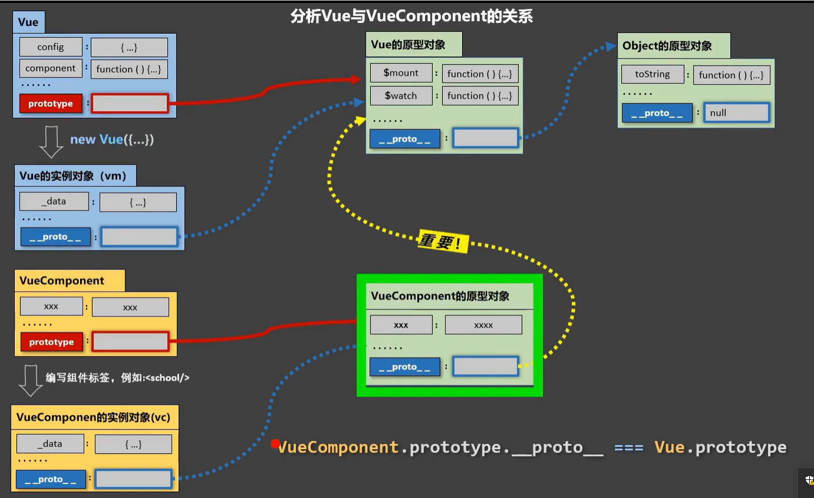

为什么要内置这样的关系：让组件实例对象VueComponent（vc）可以访问到Vue原型上的属性和方法，简化代码逻辑、实现代码的复用，使得vc实例对象可以沿着隐式原型链访问到Vue原型对象身上的属性和方法。

vm和vc的进一步区别：

+ 因为组件是可复用的 Vue 实例，所以它们与 `new Vue` 接收相同的选项，例如 `data`、`computed`、`watch`、`methods` 以及生命周期钩子等。仅有的例外是像 `el` 这样根实例特有的选项。
