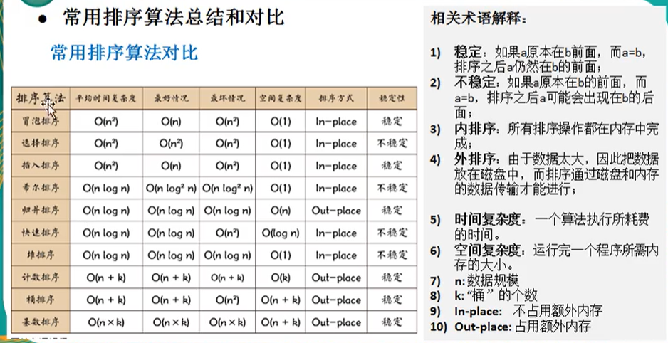
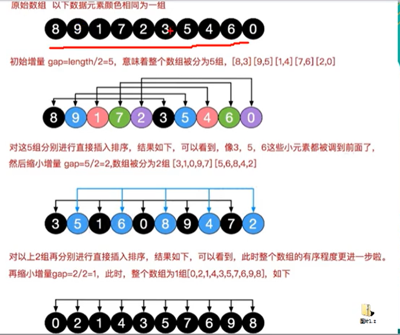
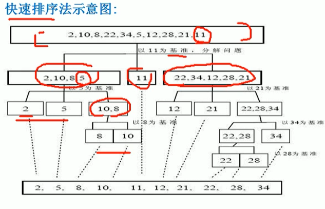
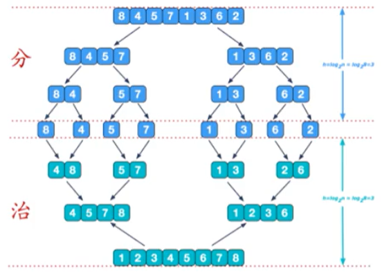
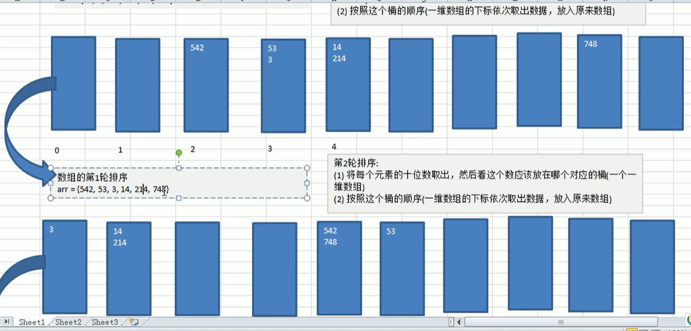

# 排序算法

常见排序算法——八大排序

时间复杂度计算：

+ 忽略常数项——用常熟1代替运行时间中的所有加法常数项
+ 忽略低次项——修改后的运行次数函数中，只保留最高阶项
+ 忽略系数——去除最高级项的系数

常见时间复杂度：

+ 常数阶O(1)
+ 对数阶O(logn)——如将每次 i 乘以2，当 i > n 时结束
+ 线性阶O(n)
+ 线性对数阶O(nlogn)——里面一层对数阶外面一层线性阶
+ 平方阶O(n^2)
+ 立方阶O(n^3)
+ k次方阶O(n^k)
+ 指数阶O(2^n)
+ O(n!)

按以上顺序依次算法复杂度增加，其执行的效率越低，应该尽可能避免使用指数阶算法



算法分析过程中主要注重时间复杂度

稳定的概念：

+ 假定在待排序记录序列中，存在多个相同关键字记录，经排序后记录的相对次序保持不变，如r[i]=r[j]，且r[i]在r[j]之前，而在排序后的序列中相对顺序不变，则称为稳定反之不稳定。

## 内部排序

将需要处理的所有数据加载到内部存储中进行排序

### 1.插入排序

#### 1.1直接插入排序

+ 从index1开始依次遍历，将元素插入到前面的有序列表中，和冒泡排序、选择排序有异曲同工之妙

时间复杂度：

+ O(n^2)
+ 时候测试：80000个随机数组使用插入排序大概5s时间，相比冒泡排序快很多，但比选择排序略慢。

```python
def insertionSort(arr): 
	for i in range(1, len(arr)): 
		key = arr[i] 
        j = i-1
        while j >=0 and key < arr[j] : 
            arr[j+1] = arr[j] 
            j -= 1
        arr[j+1] = key 
```

#### 1.2希尔排序

希尔排序，也称递减增量排序算法，是插入排序的一种更高效的改进版本。但希尔排序是非稳定排序算法。

基本思想：先将整个待排序的记录序列分割成为若干子序列分别进行直接插入排序，待整个序列中的记录"基本有序"时，再对全体记录进行依次直接插入排序，具体如下图所示：



规则：

+ 增量gap逐渐缩小
+ 从第gap个元素，逐个对其所在组直接插入排序

可分为交换式和移动式：

+ 交换式：
  + O(nlogn)
  + 时候测试：80000个随机数组使用希尔交换式排序大概17s时间，非常慢【发现一个交换一个，影响效率】
+ 移位法：相当于把插入法和缩小增量结合起来
  + O(nlogn)
  + 时候测试：80000个随机数组使用希尔移动式排序大概1s时间。

### 2选择排序

#### 2.1简单选择排序

【leetcode215数组中的第k个最大的元素：走k趟找到第k个大的值】

具体规则：

+ 一共进行len(nums)-1次大的循环
+ 每一轮排序又是一个循环，循环的代码：
  + 先假定当前数是最小数
  + 然后比较当前数和后面的数，如果发现更小的则重新确定最小数，每一轮确定一个最小值，并将最小值放到数组最前面。
  + 和冒泡排序相比较：减少了不必要的交换

时间复杂度：

+ O(n^2)
+ 时候测试：80000个随机数组使用选择排序大概3s时间，相比冒泡排序快很多

#### 2.2堆排序——和二叉树相关

### 3交换排序

#### 3.1冒泡排序

基本思想：从前向后依次比较相邻元素大小，逆序则交换。若一趟比较下来没有进行过交换，说明序列有序。每一趟排序确定了一个最大数【leetcode215数组中的第k个最大的元素：走k趟找到第k个大的值+flag优化提前终止】。

优化：因此在排序过程中设置flag判断元素是否进行过交换，减少不必要比较。

具体规则：

+ 一共进行len(nums)-1次大的循环
+ 每一趟排序的次数在逐渐减少
+ 如果发现某趟排序中，没有发生交换，则提前终止冒泡排序【优化】

时间复杂度：

+ O(n^2)
+ 时候测试：80000个随机数组使用冒泡排序大概20s时间，比较慢

#### 3.2快速排序——随着n增加，空间复杂度也增加——对冒泡排序的改进

、

算法规则：

+ 双指针与temp比较找到需要交换的值的位置
+ 向左向右递归

```python
def quickSort(arr,low,high): 
    l = low
    r = high
    pivot = arr[(low+high)//2]# 将中间索引对应的值引看作中间轴  
    while l<r:
        while arr[l] < pivot:
            l += 1
        while arr[r] > pivot:# 不要写等号，最差找到它本身就会停止
            r -=1
        if l >= r:break
        arr[l],arr[r] = arr[r],arr[l]# 交换数值
        if arr[l] == pivot:
            r-=1
        if arr[r] == pivot:
            l+=1# 避免死循环
    if l==r:# 防止栈溢出
        l+=1
        r-=1
    if low<r:
        quickSort(arr,low,r)# 向左递归
    if high>l:
        quickSort(arr,l,high)# 向右递归
```

时间复杂度：

+ O(nlogn)
+ 时候测试：80000个随机数组使用快排几乎不到1s，很快，数据量再加大，会逐渐凸显优势，比希尔排序更快

### 4归并排序——随着n增加，空间复杂度也增加



这种结构像一颗完全二叉树，本文的归并排序我们采用递归

+ 递归分解
+ 双指针合并两个有序数组，merge——n-1次

时间复杂度：

+ O(nlogn)
+ 时候测试：80000个随机数组使用归并排序大概不到1s时间，**8百万数据3s左右，和快排差不多**

### 5基数排序(桶排序)——空间换时间

概念：

+ 属于分配式排序，也称桶子法，通过键值的各个位的值，将要排序的元素分配到某些”桶“中，达到排序的作用
+ 基数排序法是效率高的稳定性排序
+ 是桶排序的扩展
+ 具体实现：将整数按位切割成不同数字，然后按每个位数分别比较



时间复杂度：

+ O(nlogn)
+ 时候测试：80000个随机数组使用归并排序大概不到1s时间，**8百万数据1s左右，很快**，但占用内存很大如八千万数据需要3G左右内存

有负数尽量不用基数排序或桶排序

## 外部排序

数据量大，需要借助外部存储进行排序
