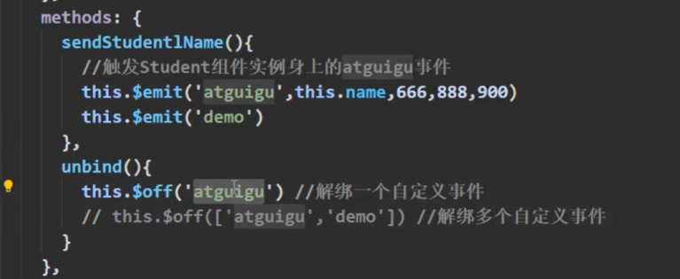
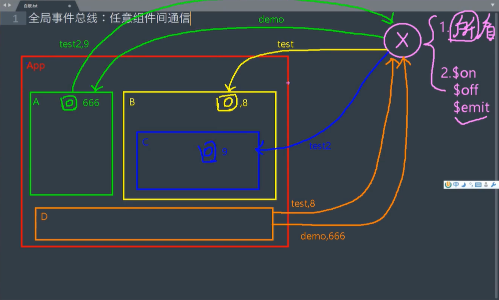

## 自定义事件

给组件使用：
JS内的事件是给html元素使用的，自定义事件是给组件使用的——因此叫做组件自定义事件
+ 一种组件间通信方式，适用于：子组件向父组件通信

+ 子绑定自定义事件，事件回调在父中

+ 绑定自定义事件：
  + 第一种：在父组件中使用@或v-on给子组件绑定自定义事件
  + 第二种：使用ref+mounted挂载——实现功能比较灵活如：等三秒后挂载事件

  + 若想让事件触发一次，可以使用once

+ 触发自定义事件：this.emit('atguigu',数据)

+ 解绑自定义事件：this.$off('atguigu')

+ 销毁当前Student组件的实例，销毁后所有Student实例的自定义事件都不奏效,dom原生事件不受影响

+ 通过red绑定自定义事件的时候，回调要么配置在methods中，要么用箭头函数，否则this指向会出问题（this指向了子组件）

+ 组件不能直接绑定原生事件，会被直接认为是自定义事件，要绑定原生事件，需要加.native

```
@click.native//将这个事件交给组件最外侧的div——组件不可以写两个根元素
```

## 全局事件总线：任意组件之间的通信

通过自定义组件事件，实现任意组件之间的通信

x作为中间人的要求：

+ 所有组件都能看到它（才能完成任意组件间的互通代理）

+ 能够调用$on/$off/$ref


