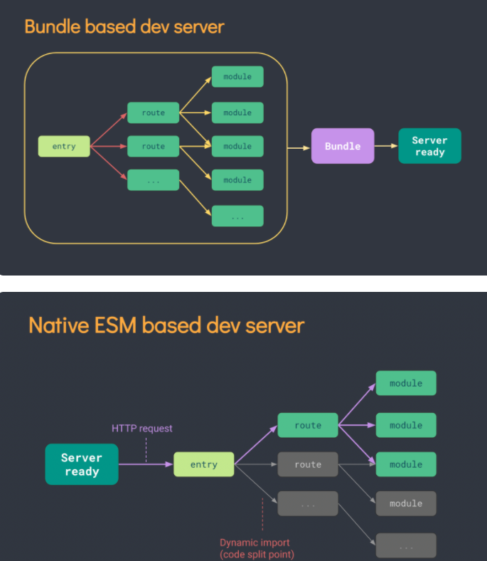

# vue3的改动

## 性能的提升

+ 打包大小减少41%
+ 初次渲染快55%，更新渲染133%
+ 内存减少54%
+ blablabla......

## 源码升级

+ 使用Proxy代替defineProperty实现响应式
+ 重写虚拟DOM的实现和Tree-Shaking

## 拥抱TypeScript

+ vue3可以更好地支持TypeScript
+ 可以继续看TS+vue教程

## 新特性

+ Composition API（组合API）
  + setup配置
  + ref与reactive
  + watch与watchEffect
  + provide与inject
+ 新的内置组件
  + Fragment
  + Teleport
  + Suspense
+ 其他改变
  + 新的生命周期钩子
  + data选项应始终被声明为一个函数
  + 移除keyCode支持作为v-on的修饰符
  + blablabla......

# 创建一个Vue3工程

第一种方式：使用脚手架vue-cli创建

+ 选择vue3版本脚手架即可，其他方式和vue2相同

第二种方式：使用vite创建

+ 官方文档：https://v3.cn.vuejs.org/guide/installation.html#vite

+ vite官网：https://vitejs.cn

  + vite是新一代前端构建工具（之前使用webpack）

  

  + 优势如下：
    + 开发环境中，无需打包操作，可快速的冷启动
    + 轻量快速的热重载（HMR）
    + 真正的按需编译，不再等待整个应用编译完成
    + 动态的引用和代码分割，使得启动更快

  ```bash
  ## 创建工程
  npm init vite-app <project-name>
  ## 进入工程目录
  cd <project-name>
  ## 安装依赖
  npm install
  ## 运行，发现启动更快了
  npm run dev
  ```
## 文件分析

### main.js

```js
// 引入的不再是Vue构造函数（构造函数需要new一下），引入的是一个名为createApp的工厂函数（直接调用）
import { createApp } from 'vue'
import App from './App/vue'

createApp(App).mount('#app')
// 上述代码类似于：
const app = createApp(App)
app.mount('#app')
```

+ 创建应用实例对象——app（类似于之前vue2中的vm，但app比vm更“”轻），不信就console.log(app)看一看
+ 会发现app身上挂载的属性和方法变少了
+ 配置vue.config.js取消语法检查
+ vue3组件中可以没有根标签
  
