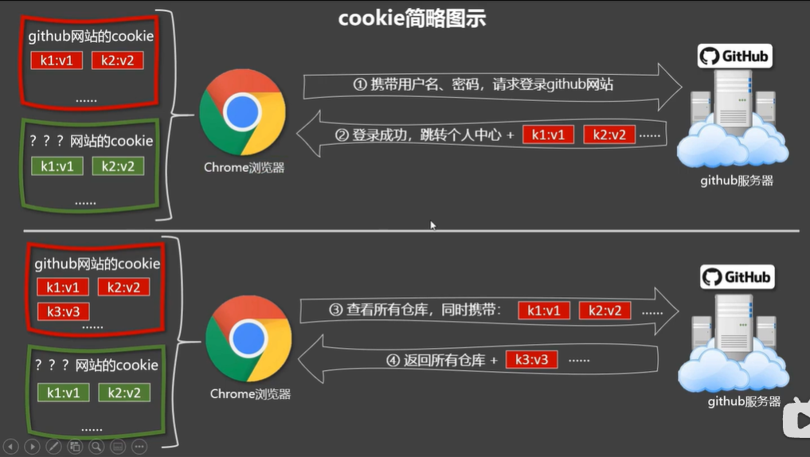

## XSS攻击

### 什么是XSS攻击？

#### 概念

XSS 攻击指的是跨站脚本攻击，是一种代码注入攻击。攻击者通过在网站注入恶意脚本，使之在用户的浏览器上运行，从而盗取用户的信息如 cookie 等。/跨站脚本攻击（Cross-Site Scripting,XSS）是指通过存在安全漏洞的Web网站注册用户的浏览器内运行非法的HTML标签或JavaScript进行的一种攻击。

XSS 的本质是因为网站没有对恶意代码进行过滤，与正常的代码混合在一起了，浏览器没有办法分辨哪些脚本是可信的，从而导致了恶意代码的执行。

**如v-html等类似指令如果出现在用户输入框中则会实现XSS攻击**

攻击者可以通过这种攻击方式可以进行以下操作：

- 获取页面的数据，如DOM、cookie、localStorage；
- DOS攻击，根本目的是使受害主机或网络无法及时接收并处理外界请求，或无法及时回应外界请求，发送合理请求，占用服务器资源，从而使用户无法访问服务器；
- 破坏页面结构；
- 流量劫持（将链接指向某网站）

#### 攻击类型

XSS 可以分为存储型、反射型和 DOM 型：

- **存储型**指的是恶意脚本会存储在目标服务器上，当浏览器请求数据时，脚本从服务器传回并执行。
- **反射型**指的是攻击者诱导用户访问一个带有恶意代码的 URL 后，服务器端接收数据后处理，然后把带有恶意代码的数据发送到浏览器端，浏览器端解析这段带有 XSS 代码的数据后当做脚本执行，最终完成 XSS 攻击。
- **DOM 型**指的通过修改页面的 DOM 节点形成的 XSS。

**1）存储型** **XSS** **的攻击步骤：**

1. 攻击者将恶意代码提交到⽬标⽹站的数据库中。
2. ⽤户打开⽬标⽹站时，⽹站服务端将恶意代码从数据库取出，拼接在 HTML 中返回给浏览器。
3. ⽤户浏览器接收到响应后解析执⾏，混在其中的恶意代码也被执⾏。
4. 恶意代码窃取⽤户数据并发送到攻击者的⽹站，或者冒充⽤户的⾏为，调⽤⽬标⽹站接⼝执⾏攻击者指定的操作。

这种攻击常⻅于带有⽤户保存数据的⽹站功能，如论坛发帖、商品评论、⽤户私信等。

**2）反射型** **XSS** **的攻击步骤：**

1. 攻击者构造出特殊的 URL，其中包含恶意代码。
2. ⽤户打开带有恶意代码的 URL 时，⽹站服务端将恶意代码从 URL 中取出，拼接在 HTML 中返回给浏览器。
3. ⽤户浏览器接收到响应后解析执⾏，混在其中的恶意代码也被执⾏。
4. 恶意代码窃取⽤户数据并发送到攻击者的⽹站，或者冒充⽤户的⾏为，调⽤⽬标⽹站接⼝执⾏攻击者指定的操作。

**反射型 XSS 跟存储型 XSS 的区别是：存储型 XSS 的恶意代码存在数据库⾥，反射型 XSS 的恶意代码存在 URL ⾥。**

反射型 XSS 漏洞常⻅于通过 URL 传递参数的功能，如⽹站搜索、跳转等。 由于需要⽤户主动打开恶意的 URL 才能⽣效，攻击者往往会结合多种⼿段诱导⽤户点击。

**3）DOM** **型** **XSS** **的攻击步骤：**

1. 攻击者构造出特殊的 URL，其中包含恶意代码。
2. ⽤户打开带有恶意代码的 URL。
3. ⽤户浏览器接收到响应后解析执⾏，前端 JavaScript 取出 URL 中的恶意代码并执⾏。
4. 恶意代码窃取⽤户数据并发送到攻击者的⽹站，或者冒充⽤户的⾏为，调⽤⽬标⽹站接⼝执⾏攻击者指定的操作。

**DOM 型 XSS 跟前两种 XSS 的区别：DOM 型 XSS 攻击中，取出和执⾏恶意代码由浏览器端完成，属于前端JavaScript ⾃身的安全漏洞，⽽其他两种 XSS 都属于服务端的安全漏洞。**

### 如何防御 XSS 攻击？

- 可以从浏览器的执行来进行预防，一种是使用纯前端的方式，不用服务器端拼接后返回（不使用服务端渲染）。另一种是**对需要插入到 HTML 中的代码做好充分的转义**。对于 DOM 型的攻击，主要是前端脚本的不可靠而造成的，对于数据获取渲染和字符串拼接的时候应该对可能出现的恶意代码情况进行判断。
- 使用 CSP ，CSP 的本质是**建立一个白名单**，告诉浏览器哪些外部资源可以加载和执行，从而防止恶意代码的注入攻击。

> 1. CSP 指的是内容安全策略，它的本质是建立一个白名单，告诉浏览器哪些外部资源可以加载和执行。我们只需要配置规则，如何拦截由浏览器自己来实现。
> 2. 通常有两种方式来开启 CSP，一种是设置 HTTP 首部中的 Content-Security-Policy，一种是设置 meta 标签的方式

- 对一些敏感信息进行保护，比如 cookie 使用 http-only（js指令：document.cookie指令可以直接拿到浏览器中未设置http-only的cookie），使得脚本无法获取。也可以使用验证码，避免脚本伪装成用户执行一些操作。Cookie的HttpOnly属性是Cookie的扩展功能，它使JavaScript脚本无法获得Cookie。其主要目的为防止跨站脚本攻击（Cross-site scripting,XSS）对Cookie的信息窃取。
